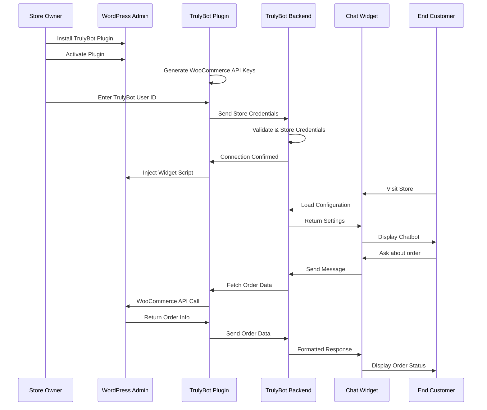
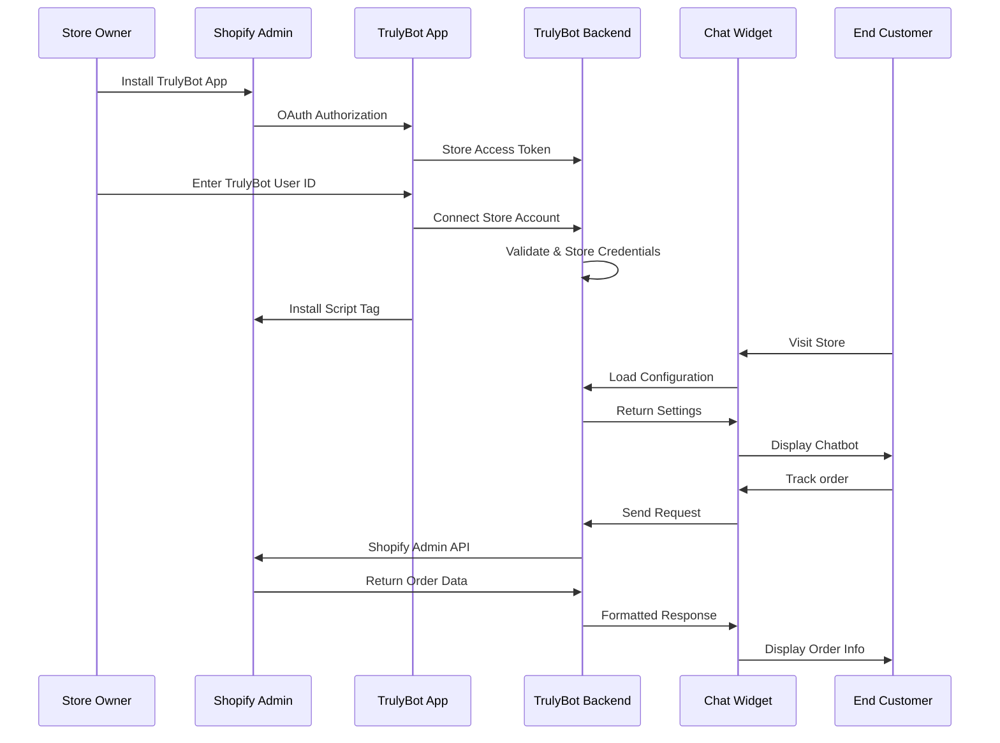

# TrulyBot E-commerce Integrations - Technical Architecture

## 🏗️ System Architecture Overview

```
┌─────────────────────────────────────────────────────────────────────────────┐
│                           TrulyBot Integration Ecosystem                    │
├─────────────────────────────────────────────────────────────────────────────┤
│                                                                             │
│  ┌─────────────────┐         ┌─────────────────┐         ┌─────────────────┐ │
│  │   WooCommerce   │         │   TrulyBot      │         │     Shopify     │ │
│  │   WordPress     │◄────────┤   Backend       ├────────►│      Store      │ │
│  │     Store       │         │      API        │         │                 │ │
│  └─────────────────┘         └─────────────────┘         └─────────────────┘ │
│           │                           │                           │           │
│           │                           │                           │           │
│  ┌─────────────────┐         ┌─────────────────┐         ┌─────────────────┐ │
│  │  WooCommerce    │         │   User's        │         │   Shopify       │ │
│  │    Plugin       │         │  Dashboard      │         │     App         │ │
│  └─────────────────┘         └─────────────────┘         └─────────────────┘ │
│           │                           │                           │           │
│           │                           │                           │           │
│  ┌─────────────────┐         ┌─────────────────┐         ┌─────────────────┐ │
│  │   Chat Widget   │         │   Widget        │         │   Chat Widget   │ │
│  │  (WooCommerce)  │◄────────┤  Configuration  ├────────►│   (Shopify)     │ │
│  └─────────────────┘         │      API        │         └─────────────────┘ │
│                               └─────────────────┘                           │
└─────────────────────────────────────────────────────────────────────────────┘
```

## 🔄 Integration Flow Diagrams

### WooCommerce Integration Flow



### Shopify Integration Flow



## 🗄️ Database Schema

### Core Tables

#### `store_integrations`
```sql
CREATE TABLE store_integrations (
    id uuid PRIMARY KEY,
    user_id uuid REFERENCES auth.users(id),
    workspace_id uuid NOT NULL,
    platform text CHECK (platform IN ('woocommerce', 'shopify')),
    
    -- Store Information
    store_url text NOT NULL,
    store_name text NOT NULL,
    store_email text,
    
    -- WooCommerce Fields
    api_key_encrypted text,
    api_secret_encrypted text,
    permissions text,
    
    -- Shopify Fields
    access_token_encrypted text,
    shop_domain text,
    
    -- Status & Config
    status text DEFAULT 'active',
    config jsonb DEFAULT '{}',
    
    -- Timestamps
    connected_at timestamptz DEFAULT now(),
    disconnected_at timestamptz,
    last_sync_at timestamptz,
    created_at timestamptz DEFAULT now(),
    updated_at timestamptz DEFAULT now()
);
```

#### `user_activities`
```sql
CREATE TABLE user_activities (
    id uuid PRIMARY KEY,
    user_id uuid REFERENCES auth.users(id),
    activity_type text NOT NULL,
    description text NOT NULL,
    metadata jsonb DEFAULT '{}',
    created_at timestamptz DEFAULT now()
);
```

## 🛡️ Security Architecture

### Authentication & Authorization

#### WooCommerce Security
```
┌─────────────────┐    ┌─────────────────┐    ┌─────────────────┐
│   WordPress     │    │   TrulyBot      │    │   Customer      │
│     Store       │    │    Backend      │    │    Browser      │
└─────────────────┘    └─────────────────┘    └─────────────────┘
         │                       │                       │
         │ 1. Generate API Keys  │                       │
         │──────────────────────►│                       │
         │                       │                       │
         │ 2. Store Encrypted    │                       │
         │    Credentials        │                       │
         │◄──────────────────────│                       │
         │                       │                       │
         │                       │ 3. Widget Request     │
         │                       │◄──────────────────────│
         │                       │                       │
         │ 4. API Call with      │                       │
         │    Basic Auth         │                       │
         │◄──────────────────────│                       │
         │                       │                       │
         │ 5. Return Order Data  │                       │
         │──────────────────────►│                       │
         │                       │                       │
         │                       │ 6. Formatted Response │
         │                       │──────────────────────►│
```

#### Shopify Security
```
┌─────────────────┐    ┌─────────────────┐    ┌─────────────────┐
│     Shopify     │    │   TrulyBot      │    │   Customer      │
│      Store      │    │    Backend      │    │    Browser      │
└─────────────────┘    └─────────────────┘    └─────────────────┘
         │                       │                       │
         │ 1. OAuth 2.0 Flow     │                       │
         │──────────────────────►│                       │
         │                       │                       │
         │ 2. Access Token       │                       │
         │◄──────────────────────│                       │
         │                       │                       │
         │                       │ 3. Widget Request     │
         │                       │◄──────────────────────│
         │                       │                       │
         │ 4. Admin API Call     │                       │
         │    with Bearer Token  │                       │
         │◄──────────────────────│                       │
         │                       │                       │
         │ 5. Return Order Data  │                       │
         │──────────────────────►│                       │
         │                       │                       │
         │                       │ 6. Formatted Response │
         │                       │──────────────────────►│
```

### Data Encryption

#### Credential Storage
```javascript
// Encryption Process
const encryptCredential = async (credential) => {
  const algorithm = 'aes-256-gcm';
  const key = process.env.ENCRYPTION_KEY;
  const iv = crypto.randomBytes(16);
  
  const cipher = crypto.createCipher(algorithm, key);
  cipher.setAAD(Buffer.from('trulybot-integration'));
  
  let encrypted = cipher.update(credential, 'utf8', 'hex');
  encrypted += cipher.final('hex');
  
  const authTag = cipher.getAuthTag();
  
  return {
    encrypted,
    iv: iv.toString('hex'),
    authTag: authTag.toString('hex')
  };
};
```

#### Data Transmission
- All API calls use HTTPS/TLS 1.3
- Certificate pinning for enhanced security
- Request signing with HMAC-SHA256
- Rate limiting and DDoS protection

## 🔌 API Architecture

### TrulyBot Backend APIs

#### Integration Management
```
POST /api/integrations/woocommerce/connect
POST /api/integrations/shopify/connect
POST /api/integrations/woocommerce/disconnect
POST /api/integrations/shopify/disconnect
GET  /api/integrations
DELETE /api/integrations?id={integration_id}
```

#### Order Tracking
```
POST /api/integrations/woocommerce/orders
POST /api/integrations/shopify/orders
GET  /api/integrations/orders/search
```

#### Widget Configuration
```
GET /api/widget/config/{userId}
GET /api/widget/woocommerce.js
GET /api/widget/shopify.js
```

### External API Integrations

#### WooCommerce REST API
```
Endpoint: {store_url}/wp-json/wc/v3/
Authentication: Basic Auth (API Key:Secret)
Endpoints:
  - GET /orders/{id}
  - GET /orders?search={query}
  - GET /system_status
```

#### Shopify Admin API
```
Endpoint: https://{shop}.myshopify.com/admin/api/2024-10/
Authentication: Bearer Token (OAuth)
Endpoints:
  - GET /orders.json?name={order_number}
  - GET /orders/{id}.json
  - GET /shop.json
```

## 🚀 Deployment Architecture

### Infrastructure Overview

```
┌─────────────────────────────────────────────────────────────┐
│                    TrulyBot Cloud Infrastructure           │
├─────────────────────────────────────────────────────────────┤
│                                                             │
│  ┌─────────────────┐  ┌─────────────────┐  ┌─────────────────┐│
│  │      CDN        │  │   Load Balancer │  │     Firewall    ││
│  │   (Cloudflare)  │  │    (AWS ALB)    │  │   (AWS WAF)     ││
│  └─────────────────┘  └─────────────────┘  └─────────────────┘│
│           │                      │                     │      │
│           └──────────────────────┼─────────────────────┘      │
│                                  │                            │
│  ┌─────────────────────────────────────────────────────────────┐│
│  │                Next.js Application Layer                   ││
│  │  ┌─────────────────┐  ┌─────────────────┐  ┌─────────────────┐││
│  │  │   API Routes    │  │   Dashboard     │  │   Widget Serve  │││
│  │  │  (Serverless)   │  │   (React SSR)   │  │  (Edge Compute) │││
│  │  └─────────────────┘  └─────────────────┘  └─────────────────┘││
│  └─────────────────────────────────────────────────────────────┘│
│                                  │                            │
│  ┌─────────────────────────────────────────────────────────────┐│
│  │                    Data Layer                              ││
│  │  ┌─────────────────┐  ┌─────────────────┐  ┌─────────────────┐││
│  │  │   Supabase      │  │     Redis       │  │   Monitoring    │││
│  │  │  (PostgreSQL)   │  │    (Cache)      │  │  (DataDog)      │││
│  │  └─────────────────┘  └─────────────────┘  └─────────────────┘││
│  └─────────────────────────────────────────────────────────────┘│
└─────────────────────────────────────────────────────────────┘
```

### Scalability Considerations

#### Horizontal Scaling
- **API Routes**: Auto-scaling serverless functions
- **Widget Delivery**: Edge-cached JavaScript files
- **Database**: Read replicas for high availability
- **Cache Layer**: Distributed Redis cluster

#### Performance Optimization
- **CDN Caching**: Global content distribution
- **Database Indexing**: Optimized queries for integrations
- **Connection Pooling**: Efficient database connections
- **Background Jobs**: Async processing for long operations

## 📊 Monitoring & Analytics

### System Monitoring

#### Key Metrics
```javascript
const metrics = {
  api: {
    requests_per_second: 'Counter',
    response_time: 'Histogram',
    error_rate: 'Gauge',
    active_connections: 'Gauge'
  },
  integrations: {
    total_connected_stores: 'Gauge',
    connection_success_rate: 'Gauge',
    order_tracking_requests: 'Counter',
    widget_load_time: 'Histogram'
  },
  business: {
    daily_active_stores: 'Gauge',
    customer_conversations: 'Counter',
    support_ticket_reduction: 'Gauge',
    customer_satisfaction: 'Histogram'
  }
};
```

#### Alerting Rules
```yaml
alerts:
  - name: HighErrorRate
    condition: error_rate > 5%
    duration: 5m
    
  - name: SlowAPIResponse
    condition: response_time_p95 > 2s
    duration: 2m
    
  - name: IntegrationFailures
    condition: connection_success_rate < 95%
    duration: 10m
```

### Business Intelligence

#### Conversion Tracking
- Chat-to-purchase correlation
- Support ticket reduction metrics
- Customer satisfaction scores
- Order tracking resolution rates

#### Usage Analytics
- Most common order tracking queries
- Peak usage times and patterns
- Store onboarding completion rates
- Feature adoption metrics

## 🔧 Maintenance & Operations

### Deployment Pipeline

```yaml
# .github/workflows/deploy.yml
name: Deploy TrulyBot Integrations
on:
  push:
    branches: [main]

jobs:
  test:
    runs-on: ubuntu-latest
    steps:
      - name: Run Integration Tests
        run: npm test -- --coverage
      
  deploy:
    needs: test
    runs-on: ubuntu-latest
    steps:
      - name: Deploy to Vercel
        run: vercel --prod
        
      - name: Update Database Schema
        run: npx supabase db push
        
      - name: Invalidate CDN Cache
        run: npx cloudflare-cli purge
```

### Backup Strategy

#### Database Backups
- **Automated**: Daily full backups to S3
- **Point-in-time**: 7-day continuous backup
- **Cross-region**: Replicated to multiple regions
- **Testing**: Monthly restore verification

#### Credential Recovery
- **Encrypted Backups**: Secure key storage
- **Key Rotation**: Automated monthly rotation
- **Access Logs**: Full audit trail
- **Emergency Access**: Secure break-glass procedures

### Health Checks

#### Automated Monitoring
```javascript
const healthChecks = {
  database: async () => {
    const result = await supabase.from('store_integrations').select('count').single();
    return result.data ? 'healthy' : 'unhealthy';
  },
  
  woocommerce_api: async () => {
    const testStore = await getTestStore('woocommerce');
    const response = await fetch(`${testStore.url}/wp-json/wc/v3/system_status`);
    return response.ok ? 'healthy' : 'unhealthy';
  },
  
  shopify_api: async () => {
    const testStore = await getTestStore('shopify');
    const response = await fetch(`https://${testStore.domain}/admin/api/2024-10/shop.json`);
    return response.ok ? 'healthy' : 'unhealthy';
  }
};
```

## 🔮 Future Enhancements

### Planned Features

#### Advanced Analytics
- Predictive customer behavior analysis
- AI-powered conversation insights
- Revenue attribution modeling
- A/B testing framework

#### Multi-channel Support
- **Email Integration**: Connect with email platforms
- **SMS Support**: Text message order updates
- **Social Media**: Facebook Messenger, WhatsApp
- **Voice Assistant**: Alexa, Google Assistant integration

#### Enhanced AI Capabilities
- **Natural Language Processing**: Better query understanding
- **Machine Learning**: Personalized responses
- **Sentiment Analysis**: Customer mood detection
- **Multilingual Support**: Real-time translation

### Technical Roadmap

#### Q1 2024
- [ ] BigCommerce integration
- [ ] Advanced order status webhooks
- [ ] Custom CSS editor in dashboard
- [ ] Mobile app for merchants

#### Q2 2024
- [ ] API rate limiting improvements
- [ ] Real-time conversation analytics
- [ ] Advanced customer segmentation
- [ ] White-label solution

#### Q3 2024
- [ ] Voice chat capabilities
- [ ] Video call integration
- [ ] AR product visualization
- [ ] Blockchain order verification

---

This technical architecture ensures scalable, secure, and maintainable e-commerce integrations that provide excellent customer experiences while maintaining high performance and reliability.